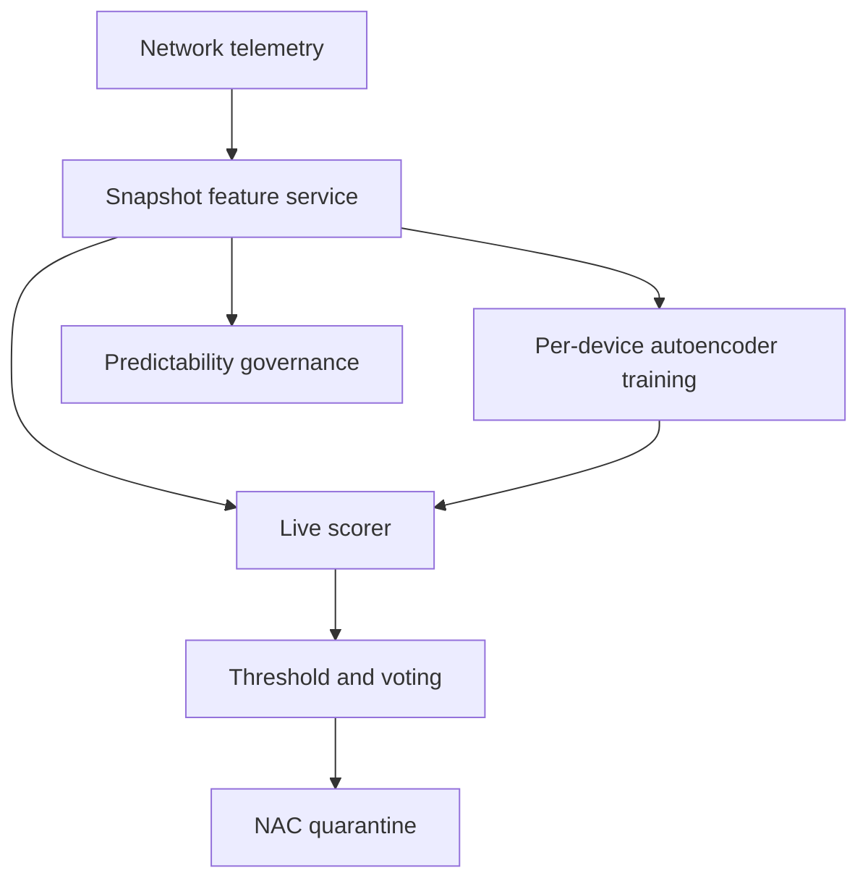

# BotLens

**Source:** `ai-in-iot/1805.03409v1/`
**Domain:** `ai-iot`
**One-liner:** A network-side deep-autoencoder sentinel that learns each IoT device’s benign traffic snapshots and flags Mirai/BASHLITE-class attack execution in under a second, so enterprises can cut bots off before outbound DDoS ramps.
**Wedge:** Large enterprises and campuses with heterogeneous Wi-Fi IoT (including BYO wearables and facilities devices) that need centralized detection of *attack launch*, not only early infection scanning.
**Positioning:** Per-device deep autoencoder NIDS for IoT botnets. NetRoster whitelists device *type* from behavior; ShadeScan inspects *binaries* on-device; QuorumSense merges on-device models; BotLens productizes N-BaIoT — 115-dimensional behavioral snapshots and deep autoencoders that reconstruct normality and fail loud on Mirai/BASHLITE attack traffic, with empirical sub-second isolation potential versus DDoS attacks that often last 20–90+ seconds.

## Market research synthesis

### Thesis from source

IoT proliferation plus unpatchable devices produced botnet DDoS at unprecedented volume. Mirai-class botnets proceed through propagation, infection, C&C, and attack execution; most prior detectors focus on early steps. Enterprises face many heterogeneous Wi-Fi IoT devices — self-deployed and visitor BYO — and need a centralized, automated answer to: can we detect compromised devices *as they launch attacks*?

N-BaIoT extracts statistical behavioral snapshots (115 traffic features over multiple temporal windows) of benign IoT traffic and trains a deep autoencoder *per device* to compress normality. Reconstruction failure marks anomaly. Deep autoencoders beat common anomaly baselines on false alarms because IoT devices are task-oriented with few normal patterns, yet still capture infrequent benign actions (e.g., boots) when trained well. Lab evaluation infected nine commercial devices with Mirai and BASHLITE; the method detected attacks as launched, optimized thresholds for 0% FPR on optimization sets, and showed mean FPR on the order of 0.007±0.01 with competitive TPR and faster detection than alternatives. Cutting a device in less than a second is framed against typical DDoS durations (often 20–90 seconds, with long tails of hours/days). The paper also notes predictability varies by device capability (baby monitors with rich sensors are harder), suggesting organizational policies may refuse low-predictability devices — a productizable governance feature.

### Buyer & economic model

- **Primary buyer:** CISO / Network Security Architecture at enterprises and universities.
- **Users:** SOC analysts, network engineers, IoT procurement/governance, NAC operators.
- **Budget owner / value metric:** network security and DDoS/abuse budget. Value metrics: time-to-detect attack execution, FPR, outbound attack Mbps avoided, % IoT inventory under a model.
- **Competing status quo:** generic NIDS signatures; DHCP fingerprints only; cloud IoT security agents that devices cannot run; early-stage scanners that miss already-enrolled bots launching attacks.

### Domain constraints

- **Regulatory / trust / safety:** false quarantine of medical or safety IoT is unacceptable — policy must tier responses; packet features may be regulated as monitoring.
- **Data sensitivity:** flow statistics can still fingerprint users (wearables); retain aggregates with purpose limits.
- **Change-management realities:** needs benign training windows; devices compromised *before* enrollment need transfer-learning / deny-unknown strategies the paper flags as future work — product must not pretend cold-start magic.

## Business requirements

- BR-1: Each managed IoT device (or identical twin group, when validated) must have a dedicated normality model trained only on labeled benign windows.
- BR-2: Detection must target attack-execution behaviors (e.g., Mirai/BASHLITE attack traffic), with time-to-detect optimized for sub-second class isolation hooks.
- BR-3: False-positive rate must be tunable via threshold and voting window, with defaults aiming at near-zero FPR on validation windows as in the source methodology.
- BR-4: Feature extraction must use behavioral traffic snapshots (statistical, multi-window) without requiring payload DPI of encrypted bodies.
- BR-5: When anomaly score breaches policy, the platform must emit a NAC/quarantine action with device identity and evidence summary.
- BR-6: Device predictability scoring must inform admission governance — low-predictability devices can be flagged or blocked from sensitive VLANs.
- BR-7: Training data provenance must prove the benign window, so models are not fit on already-infected traffic.
- BR-8: SOC workflows must distinguish boot/rare benign spikes from sustained attack patterns using voting windows.
- BR-9: Coverage reporting must show which inventory assets lack models or are in learning mode.
- BR-10: Canary transfer of models between identical SKUs must be explicitly validated before reuse across sites.
- BR-11: Outbound attack volume avoided during incidents must be measurable for executive reporting.
- BR-12: Commercial packaging prices by monitored IoT endpoints and retention of forensic snapshots.

## User stories

Canonical user stories live in sibling [USER_STORIES.md](USER_STORIES.md).

## System design

### Overview

BotLens sits on enterprise network telemetry (SPAN/NetFlow/ENRICHED stats). A feature service builds 115-dimensional multi-window snapshots per device. Training jobs fit deep autoencoders on benign windows; inference scores live snapshots; policy triggers NAC. Governance services compute predictability and inventory coverage. Optional twin-model promotion supports validated SKU reuse.

### Actors & boundaries

- **Actors:** SOC, network eng, governance, detection eng, IoT devices (observed only), NAC.
- **Trust boundary:** mirrors/statistics enter the detector; devices are not agents. Quarantine actions cross into the network control plane under policy.
- **Human-in-the-loop points:** benign-window certification, threshold changes, clinical-device exceptions, twin-model promotion.

### Core capabilities

1. **Inventory and learning-mode onboarding**
2. **Behavioral snapshot feature extraction**
3. **Per-device autoencoder training**
4. **Live anomaly scoring and voting windows**
5. **NAC quarantine orchestration**
6. **Predictability scoring and admission policy**
7. **Drill/reporting for TPR/FPR**
8. **Forensic snapshot retention**

### Conceptual data

- **Primary entities:** Device, BenignWindow, Snapshot, AutoencoderModel, AnomalyEvent, QuarantineAction, PredictabilityScore, CoverageReport.
- **Critical events:** learning started, model ready, anomaly scored, quarantined, exception granted, twin promoted.
- **Retention / audit needs:** models and quarantine decisions retained for incident/legal windows; raw PCAP optional/off.

### Integrations (conceptual)

- **Systems of record:** CMDB/NAC, DHCP/fingerprint, SIEM.
- **Upstream signals:** NetFlow/IPFIX, switch mirror stats, wireless controller metadata.
- **Downstream actions:** VLAN quarantine, firewall blocks, ticket open, exec attack-Mbps reports.

### High-level architecture

### Success metrics

- **Leading:** % inventory modeled; median detect latency; FPR by class; learning-mode dwell time.
- **Lagging:** outbound attack Mbps avoided; incident MTTR; repeat infections per device; procurement blocks of low-predictability gear.

## OpenAPI skeleton

Canonical HTTP surface lives in sibling [openapi.yaml](openapi.yaml). Summary:

- **Base path:** `/v1/...`
- **Auth:** `X-API-Key` for sensors/NAC; Bearer JWT for operators.
- **Resource groups:** Devices, Models, Snapshots, Alerts, Quarantine, Governance.
