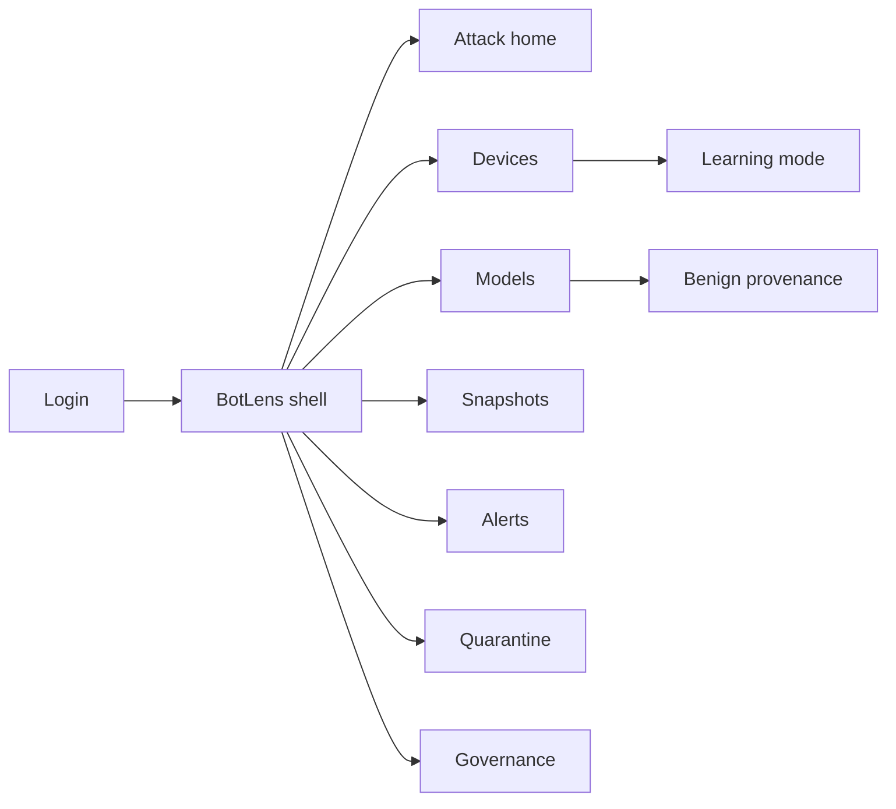
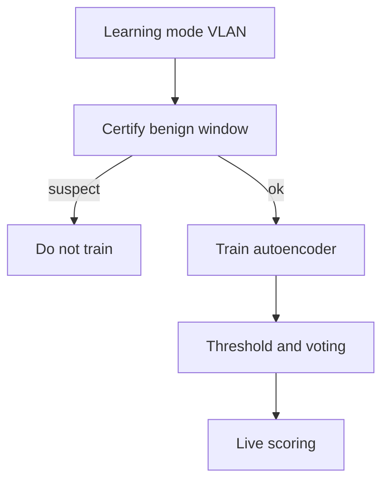
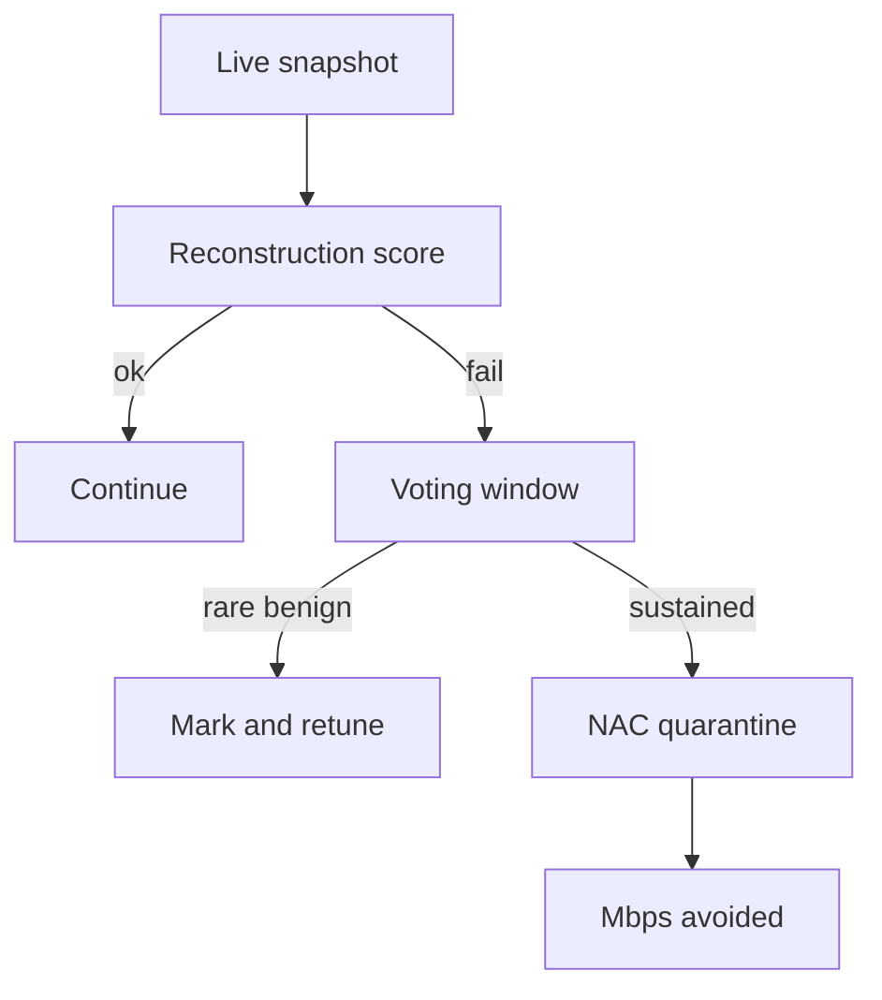

# BotLens — Web app

**Product:** [PRODUCT.md](./PRODUCT.md)
**Primary surface:** IoT botnet attack-execution console (SOC + NAC under one BotLens shell)
**Secondary surfaces:** Executive attack-Mbps avoided report (read-only); benign-window provenance viewer
**Design thesis:** BotLens is a per-device normality darkroom — the UI metaphor is reconstruction error lighting up when a quiet IoT node suddenly speaks botnet, not a generic threat-intel wall. Visual language is deep slate with lens-cyan “in model” calm and siren-red attack-execution quarantine: sub-second isolation feels like shutting a valve before the flood; a learning-mode device feels provisional, never “secure.” The wordmark sits as a quiet cyan aperture on every quarantine and model screen so analysts know whose autoencoder judged the snapshot.

## UX research synthesis

### Category peers (best-in-class)

- **Armis Centrix / Ordr:** Agentless IoT asset inventory, risk, and NAC policy hooks for enterprise Wi-Fi/OT. Steal: inventory coverage and learning-mode onboarding; reject vulnerability sprawl as the home — BotLens’s home is attack-execution reconstruction fails.
- **Darktrace (Antigena / Cyber AI Analyst):** Autonomous response with evidence narratives for anomalous traffic. Steal: explain which feature groups drove the score; reject black-box “AI antigen” as the only explanation — BotLens shows snapshot reconstruction error and voting windows.
- **ExtraHop Reveal(x):** Wire-data detections with device timelines and MITRE-ish context without full payload DPI. Steal: statistical/behavioral features over encrypted traffic (BR-4); reject enterprise east-west sprawl drowning IoT-specific Mirai/BASHLITE execution.
- **Cisco ISE + Stealthwatch pairing:** Quarantine orchestration with policy exceptions for critical devices. Steal: tiered response for clinical/safety IoT (domain constraint); reject signature-only botnet lists as the primary detector.

### Patterns to adopt / reject

- **Adopt:** Per-device (or validated twin) autoencoders; benign-window provenance; voting windows for boot vs sustained attack; sub-second NAC hooks; predictability scores for procurement; coverage of modeled vs unmodeled; attack Mbps avoided reporting; no payload DPI required.
- **Reject:** One global IoT model by default; cold-start “secure on day zero” claims for pre-infected devices; purple AI glow; editable quarantine evidence; dashboard-of-CVE home; silencing a device forever from one benign mark.

### Trust, density, and workflow constraints from PRODUCT.md

False quarantine of medical/safety IoT is unacceptable — responses tiered (domain). Benign training provenance required (BR-7); devices compromised before enrollment need explicit deny-unknown / transfer strategies — no cold-start magic. FPR tunable via threshold and voting (BR-3, BR-8). Flow stats can fingerprint wearables — retention purpose-bound. Twin-model reuse across SKUs must be validated (BR-10).

## Information architecture

### Nav model

### Roles → default home

| Role | Default home | Why |
|------|--------------|-----|
| SOC analyst | Attack home / Alerts | Sub-second execution detect (BR-2) |
| Network engineer | Quarantine + learning VLANs | NAC hooks (BR-5) |
| IoT governance lead | Governance coverage & predictability | Admission policy (BR-6, BR-9) |
| Detection engineer | Models + drills | FPR/TPR readiness (BR-3, BR-7) |
| Compliance officer | Quarantine audit / retention | Defensible clinical exceptions |

### Cross-links to OpenAPI resources

| Nav area | OpenAPI tags / resources |
|----------|---------------------------|
| Inventory / learning mode | Devices |
| Per-device autoencoders | Models |
| Behavioral snapshots | Snapshots |
| Reconstruction anomalies | Alerts |
| NAC isolation | Quarantine |
| Predictability & coverage | Governance |

## Screen inventory

### Attack home

- **Purpose:** Answer “which IoT nodes are launching attack-like traffic right now, and how fast did we cut them?” in one composition.
- **Entry:** SOC default; deep link from quarantine events.
- **Layout regions:** Brand chrome; KPI strip (median detect latency, open attack alerts, FPR rolling, Mbps avoided this period, % inventory modeled); live alert feed; coverage gap callout for unmodeled BYO.
- **Primary actions:** Open alert; quarantine; open coverage gaps.
- **Empty / loading / error:** Empty healthy = “no attack-execution anomalies” with last score time; error = retry with request id.
- **BR / story ties:** BR-2, BR-9, BR-11.

### Device inventory and learning mode

- **Purpose:** Onboard devices into learning-mode VLANs; enforce benign windows before protection claims.
- **Entry:** Devices nav; network engineer path.
- **Layout regions:** Device table (class, model state learning/ready, predictability, VLAN); learning progress; deny-unknown badge for never-trained.
- **Primary actions:** Start learning; certify benign window; move to monitored; exception request for clinical.
- **Empty / loading / error:** Pre-infected suspicion = amber “do not train on this window” blocking cue.
- **BR / story ties:** BR-1, BR-7; network engineer learning-VLAN story.

### Models

- **Purpose:** Per-device deep autoencoder jobs with benign provenance and threshold settings.
- **Entry:** Models nav; detection engineer default secondary.
- **Layout regions:** Model list (device, trained-on window id, FPR on validation, threshold, voting window); twin-promotion panel (validated SKU only).
- **Primary actions:** Train; retune threshold; promote twin after validation; rollback.
- **Empty / loading / error:** Twin promote blocked without cross-site validation (BR-10).
- **BR / story ties:** BR-1, BR-3, BR-10; detection engineer stories.

### Benign provenance viewer

- **Purpose:** Prove the model was fit only on labeled benign windows — not already-infected traffic.
- **Entry:** Model detail → Provenance.
- **Layout regions:** Window timeline; certifier identity; traffic summary stats; infection-suspicion checks.
- **Primary actions:** Recertify; invalidate model; export provenance.
- **Empty / loading / error:** Missing cert = model cannot go live.
- **BR / story ties:** BR-7.

### Snapshots

- **Purpose:** Inspect 115-dim multi-window behavioral snapshots and reconstruction error contributions without payload DPI.
- **Entry:** Snapshots nav; from alert evidence.
- **Layout regions:** Snapshot table; feature-group contribution chart; temporal windows; encrypted-body note (no DPI).
- **Primary actions:** Mark rare benign for voting retune; pin to alert; set retention.
- **Empty / loading / error:** Retention expiry removes detail per policy.
- **BR / story ties:** BR-4, BR-8; SOC evidence story.

### Alerts

- **Purpose:** Reconstruction-failure events with voting-window state distinguishing boots from sustained attacks.
- **Entry:** Alerts nav; home feed.
- **Layout regions:** Queue (score, votes, device, class Mirai/BASHLITE-like tags if matched); evidence pane; mark-benign action with retune suggestion (not permanent silence).
- **Primary actions:** Quarantine; mark benign rare; open snapshot; escalate.
- **Empty / loading / error:** Empty = healthy message; silenced-forever anti-pattern blocked in UI.
- **BR / story ties:** BR-2, BR-8; SOC analyst stories.

### Quarantine

- **Purpose:** NAC/quarantine actions with device identity, evidence summary, and tiered exceptions for safety IoT.
- **Entry:** Quarantine nav; alert action.
- **Layout regions:** Active isolations; policy tier (standard / clinical-exception); Mbps avoided counter during event; release workflow with dual ack for clinical.
- **Primary actions:** Isolate; release; open compliance proof.
- **Empty / loading / error:** NAC integration fail = coral blocking banner.
- **BR / story ties:** BR-5, BR-11; compliance policy-driven quarantine story.

### Governance

- **Purpose:** Predictability scores and admission policy; coverage of modeled vs unmodeled inventory for BYO gaps.
- **Entry:** Governance nav; governance lead default.
- **Layout regions:** Predictability by device class; VLAN admission rules; coverage report; procurement refuse list for low-predictability on sensitive nets.
- **Primary actions:** Block class from VLAN; require learning; export coverage for exec.
- **Empty / loading / error:** Unmodeled critical VLAN = amber gap banner.
- **BR / story ties:** BR-6, BR-9; governance stories.

### Drill and readiness

- **Purpose:** Mirai/BASHLITE-like drill dashboards for TPR/FPR by device class.
- **Entry:** From Models → Drills; detection engineer.
- **Layout regions:** Drill runs; TPR/FPR tables; detect latency distribution vs DDoS duration reference (20–90s).
- **Primary actions:** Schedule drill; export readiness.
- **Empty / loading / error:** No drills = readiness incomplete badge.
- **BR / story ties:** BR-2, BR-3; detection engineer readiness story.

### Executive Mbps-avoided report

- **Purpose:** Measurable outbound attack volume avoided for budget owners.
- **Entry:** Report export from home/quarantine; read-only secondary surface.
- **Layout regions:** Period selector; Mbps avoided; incidents; coverage %.
- **Primary actions:** Export PDF/CSV.
- **Empty / loading / error:** Empty period = zero incidents message (not blank).
- **BR / story ties:** BR-11, BR-12.

## Key flows

1. **Onboard and protect a device** — learn VLAN → certify benign window → train autoencoder → set threshold/voting → monitor; failure: uncertified window or pre-infection suspicion.

2. **Attack execution to quarantine** — snapshot → reconstruction fail → voting confirms sustained → NAC isolate → Mbps avoided logged; failure: clinical tier requires exception path (BR-2, BR-5).

3. **Governance refuse low-predictability** — score class → block sensitive VLAN → procurement notify (BR-6).

4. **Twin model promotion** — validate identical SKU → canary site → promote or reject (BR-10).

5. **Mark rare benign** — SOC marks boot spike → adjust voting — device not permanently silenced (BR-8).

## Design system

### Tokens (CSS variables)

- `--color-ink: #E8EEF4` — primary text
- `--color-slate-950: #0A1018` — app ground
- `--color-slate-900: #121A24` — panels
- `--color-slate-700: #2A3848` — rules
- `--color-lens: #4EC5D8` — in-model / calm monitored
- `--color-lens-dim: #2A6F7C` — lens on dark
- `--color-amber: #E6A23C` — learning / unmodeled gap
- `--color-siren: #E85D4C` — attack execution / quarantine
- `--color-steel: #7A9BB0` — secondary labels
- `--color-brand: #9FD4E0` — BotLens wordmark
- `--font-display: "IBM Plex Sans", sans-serif`
- `--font-mono: "IBM Plex Mono", monospace` — device ids, snapshot ids, scores
- `--space-1`…`--space-8`: 4px scale
- `--radius-sm: 4px`; `--radius-md: 8px`
- `--motion-score: 160ms ease-out` — reconstruction flash
- `--motion-quarantine: 220ms ease-in-out` — siren isolate
- `--motion-learn: 300ms linear` — learning progress
- Atmosphere: subtle aperture/vignette on slate-900; no stock “hacker botnet” collage.

### Typography & brand

- Display for latency and Mbps numerals; mono for scores and evidence ids.
- Brand on quarantine and model views; login: “Catch the launch, not the rumor.”

### Do / don’t

- **Do:** Per-device models; show provenance; voting before permanent silence; tiered clinical quarantine; coverage gaps visible.
- **Don’t:** Purple AI glow; one global IoT brain default; payload DPI theater; CVE wallpaper home; forever-mute from one benign mark.

### Accessibility & domain trust cues

- AA+ on lens/siren; quarantine labeled in text.
- Live regions for attack alerts and isolate confirmations.
- Focus: devices → provenance/models → alerts → quarantine → governance.

## Component patterns

- **ReconstructionScore** — error vs threshold with voting state.
- **BenignWindowCert** — attested training provenance.
- **LearningModeBadge** — provisional, not “secured.”
- **FeatureGroupBlame** — which snapshot groups drove error.
- **QuarantineActionBar** — NAC isolate with tier/exception.
- **PredictabilityChip** — class monitorability for admission.
- **CoverageGapBanner** — unmodeled inventory on sensitive VLANs.
- **MbpsAvoidedStat** — executive attack volume metric.
- **TwinPromoteGate** — validated SKU reuse only.

## Out of scope for v1 web

- On-device agents; binary malware sandbox (ShadeScan lane); full vulnerability management; PCAP warehouse as default; consumer parental-control app; MSSP multi-tenant white-label.
